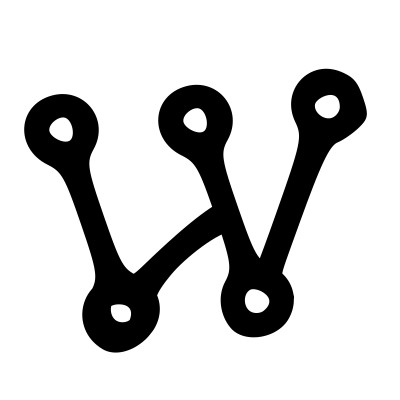

<h1 align="center">Hi 👋, I'm Sanjar</h1>
<h3 align="center">A passionate Software Engineer from India</h3>

 

  

✨ Data Engineer | Prev. PM @girlscript  
⚡ Check my ✨ [Website](https://5ffeaf24cb70a.site123.me/) or 🌱 [eBook](https://dev.recodehive.com/book) 
📫 How to reach me: [Schedule Call](https://blog.recodehive.com/topmate) or Join  [Newsletter](https://dev.recodehive.com/sub) 
👯 Join my opensource community [recodehive](https://i.recodehive.com/join) 
💬 Ask me about SEO/Data Science. 

- 📫 How to reach me **codemonu77@gmail.com**

- ⚡ Fun fact **I am Funny**

<h3 align="left">Connect with me:</h3>

<h3 align="left">Languages and Tools:</h3>

                        

&nbsp;

<h3> Languages, Tools and Technologies 🚀 </h3>
<table>
	<tr>
	<td><strong>Programming Languages</strong></td>
	<td></td>
</tr>
<tr>
	<td><strong>Database Technologies</strong></td>
	<td></td>
</tr>
<tr>
	<td><strong>Frontend Development</strong></td>
	<td></td>
</tr>
<tr>
	<td><strong>Backend Development</strong></td>
	<td></td>
</tr>

<tr>
	<td><strong>Frameworks</strong></td>
	<td></td>
</tr>

<tr>
	<td><strong>Developer Tools</strong></td>
	<td></td>
</tr>

</table>
 

## :zap: Open Source Programs & Achievements

  <table>
    <tr align="center">
      <td style="border-right: 1px solid #dddddd; padding: 15px;" valign="top" width="50%">
        <a href="">
          
           
          <strong>GirlScript Summer of Code</strong>
        </a>
         
        🏅 Ranked 17th
         
        
	  Out of 17,000+ participants 
          PRs Merged: 154 
          Total Badges: 8 
          Total Score: 3020 
        
      </td>
      <td style="padding: 15px;" valign="top" width="50%">
        <table>
          <tr align="center">
            <td style="border-right: 1px solid #dddddd; padding: 10px;" width="100">
              
               
              <strong>Explorer Badge</strong>
            </td>
            <td style="border-right: 1px solid #dddddd; padding: 10px;" width="100">
              
               
              <strong>Adventurer Badge</strong>
            </td>
            <td style="border-right: 1px solid #dddddd; padding: 10px;" width="100">
              
               
              <strong>Champion Badge</strong>
            </td>
            <td style="padding: 10px;" width="100">
              
               
              <strong>Trailblazer Badge</strong>
            </td>
          </tr>
          <tr align="center">
            <td style="border-right: 1px solid #dddddd; padding: 10px;" width="100">
              
               
              <strong>Summit Seeker Badge</strong>
            </td>
            <td style="border-right: 1px solid #dddddd; padding: 10px;" width="100">
              
               
              <strong>Innovator Badge</strong>
            </td>
            <td style="border-right: 1px solid #dddddd; padding: 10px;" width="100">
              
               
              <strong>Conqueror Badge</strong>
            </td>
            <td style="padding: 10px;" width="100">
              
               
              <strong>API Student Expert</strong>
               
              Postman
            </td>
          </tr>
        </table>
      </td>
    </tr>
  </table>

 

  <table>
    <tr align="center">
      <td style="border-right: 1px solid #dddddd; padding: 15px;" valign="top" width="50%">
        <a href="">
          
           
          <strong>GirlScript Summer of Code Extended</strong>
        </a>
         
        🏅 Ranked 3rd (Girls Category)
         
        
          1-month program 
          PRs Merged: 160 
          Total Badges: 9 
          Total Score: 4115 
        
      </td>
      <td style="padding: 15px;" valign="top" width="50%">
        <table>
          <tr align="center">
            <td style="border-right: 1px solid #dddddd; padding: 10px;" width="100">
              
               
              <strong>Explorer Badge</strong>
            </td>
            <td style="border-right: 1px solid #dddddd; padding: 10px;" width="100">
              
               
              <strong>Adventurer Badge</strong>
            </td>
            <td style="border-right: 1px solid #dddddd; padding: 10px;" width="100">
              
               
              <strong>Champion Badge</strong>
            </td>
            <td style="padding: 10px;" width="100">
              
               
              <strong>Trailblazer Badge</strong>
            </td>
          </tr>
          <tr align="center">
            <td style="border-right: 1px solid #dddddd; padding: 10px;" width="100">
              
               
              <strong>Summit Seeker Badge</strong>
            </td>
            <td style="border-right: 1px solid #dddddd; padding: 10px;" width="100">
              
               
              <strong>Innovator Badge</strong>
            </td>
            <td style="border-right: 1px solid #dddddd; padding: 10px;" width="100">
              
               
              <strong>Conqueror Badge</strong>
            </td>
            <td style="padding: 10px;" width="100">
              
               
              <strong>API Student Expert</strong>
               
              Postman
            </td>
          </tr>
          <tr align="center">
            <td colspan="4" style="padding: 10px;">
              
               
              <strong>Web3 Hack Badge</strong>
            </td>
          </tr>
        </table>
      </td>
    </tr>
  </table>

 

<!-- Connect with Me Section -->
<h2 align="center">Connect with Me</h2>

 
 

<!-- 

-->
